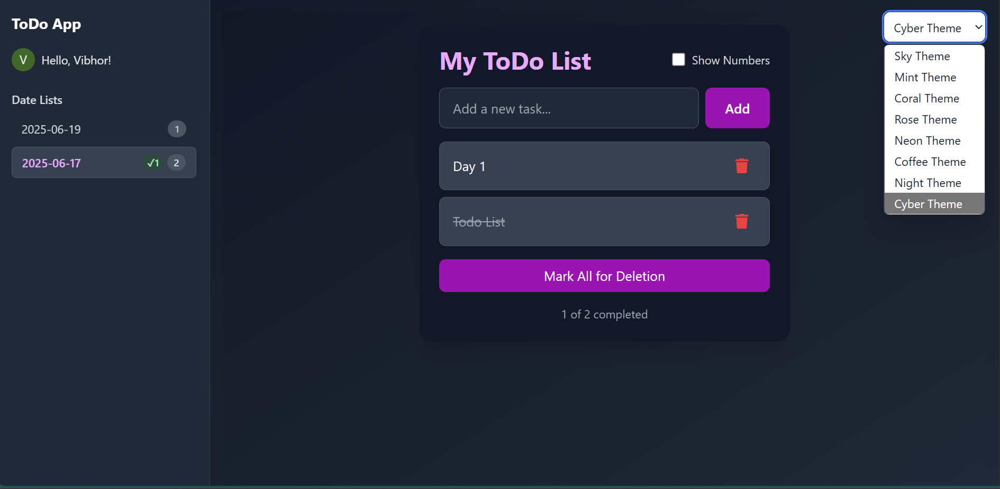
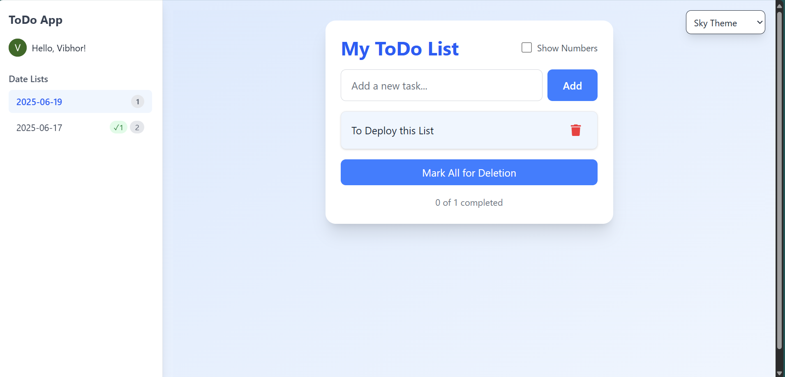

# To Do App

A custom **To Do List** web application built from scratch with a clean and minimal UI. It supports multiple themes, user authentication, and persistent storage using Firebase. Designed with reusability and modularity in mind.

---

## Tech Stack

- **Frontend**: [React](https://react.dev/) + [Vite](https://vitejs.dev/) + [Tailwind CSS](https://tailwindcss.com/)
- **Authentication**: [Clerk](https://clerk.dev/)
- **Backend**: [Firebase Firestore](https://firebase.google.com/docs/firestore)

---

## Features

- User Authentication (Sign In / Sign Up via Clerk)
- Tasks saved Date-wise in Firebase
- Persistent storage & real-time sync
- 8 Unique Themes (e.g., Sky, Cyber, Dark, etc.)
- Fully Responsive & Mobile-friendly
- Reusable Components (Sidebar, TodoInput, TodoList, etc.)
- Optimized with Vite for fast performance

---

## Demo Previews




---

## Folder Structure
```bash
TODO-APP/
├── clerk-react/
├── src/
      ├── main.jsx
      ├── App.jsx
      ├── firebase.jsx
      ├── firestore.js
      └── components/
            ├── Sidebar.jsx
            ├── TodoInput.jsx
            ├── TodoItem.jsx
            └── TodoList.jsx
```
---

## Getting Started

### 1. Clone the Repo

```bash
git clone https://github.com/VikingForcee/To-Do-App.git
cd To-Do-App
```

2. Install Dependencies
```bash
npm install
```

3. Setup Environment Variables
Create a .env file in the root and add your Firebase and Clerk credentials:

```bash
VITE_FIREBASE_API_KEY=your_key
VITE_FIREBASE_AUTH_DOMAIN=your_auth_domain
VITE_FIREBASE_PROJECT_ID=your_project_id
VITE_FIREBASE_STORAGE_BUCKET=your_bucket
VITE_FIREBASE_MESSAGING_SENDER_ID=your_sender_id
VITE_FIREBASE_APP_ID=your_app_id
VITE_CLERK_PUBLISHABLE_KEY=your_clerk_key
```

4. Run the App
```bash
npm run dev
```

## Contributing
Contributions are welcome! Please fork the repository and open a pull request with your changes.

## Author
Vibhor Gupta
Software Developer| AI ML Enthusiast | [LinkedIn](https://www.linkedin.com/in/vibhor-gupta-221a3328a/) | [GitHub](https://github.com/VikingForcee)
